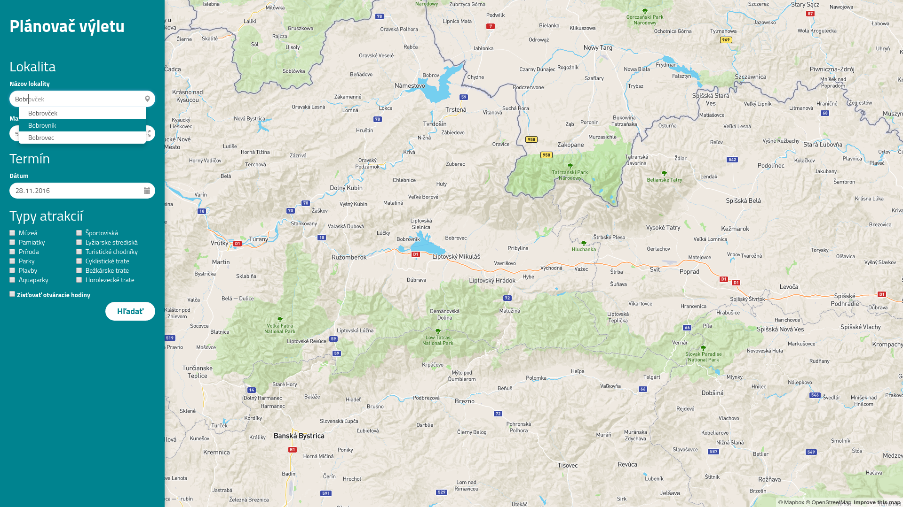
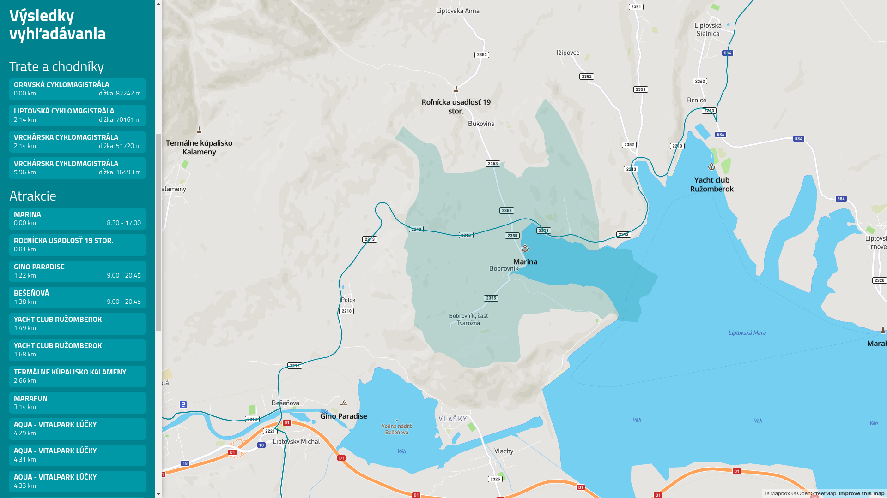

# Úvod

Táto aplikácia slúži pre vyhľadávanie turistických atrakcií podľa používateľom zadaných preferencií.
Aplikácia poskytuje tieto funkcie:
- výber lokality (mesta, okresu) v ktorom sa má hľadať a maximálnej vzdialenosti od tohto miesta s automatickým dopľňaním názvu lokality
- výber turistických atrakcií podľa typov (múzeá, športoviská, cyklistické chodníky a pod.)
- možnosť zvolenia dátumu výletu a načítania otváracích hodín atrakcií z portálu [otvaracie-hodiny.sk](http://www.otvaracie-hodiny.sk)
- zobrazenie nájdených atrakcií na mape spolu s prehľadným zoznamom v sidebare:
  - so zobrazením jej:
    - názvu 
    - vzdialenosti od zvolenej lokality
    - otváracích hodín podľa dátumu (pri podporovaných atrakciách)
    - dĺžky (v prípade, že sa jedná o chodník alebo trasu)
  - po kliknutí na položku zoznamu sa mapa presunie a priblíži na danú atrakciu

#### Vyhľadávanie:


#### Výsledky vyhľadávania:


Apikácia sa skladá z [používateľského rozhrania](#frontend), ktoré zobrazuje mapu a vyhľadávací formulár a [backendu](#backend), ktorý vykonáva dopyty nad databázou a realizuje [aplikačné rozhranie](#api), prostredníctvom ktorého tieto dve časti komunikujú.

# Frontend

Používateľské rozhranie je realizované formou statického HTML dokumentu (`index.html`). Pre lepšiu interakciu s používateľom využíva knižnicu [jQuery](https://jquery.com/) a framework [Bootstrap](http://getbootstrap.com/). 

Mapa je zobrazovaná prostredníctvom pluginu [MapBox](http://www.mapbox.com). Súbor (`scripts/map.js`) obsahuje vlastné definície zdrojov a vrstiev, ktoré aplikácia na mape zobrazuje. Pri vyhľadávaní sa oblasť zvolenej lokality vyfarbí pozadím, atrakcie sa na mape zobrazia spolu s ich názvom a ikonou (podľa typu atrakcie) a turistické chodníky či trate sa vyfarbia zelenou farbou.

V súbore (`scripts/pdt.js`) sa nachádzajú metódy pre volanie [aplikačného rozhrania](#api) a spracovanie prijatých výsledkov, vrátane ich zobrazenia v bočnom paneli spolu s ďalšími údajmi. 

# Backend

Backendová aplikácia je napísaná v jazyku [PHP 5.6](http://www.php.net) a nachádza sa v súbore (`api/api.php`). Podľa prijatých požiadaviek z [frontendu](#frontend) vykonáva dopyty nad [PostgreSQL](https://www.postgresql.org) databázou a výsledky vracia v JSON formáte.

V prípade, že si používateľ zvolí funkciu vyhľadávania otváracích hodín atrakcií, volá sa funkcia súboru (`api/oh_parser.php`). Táto prostredníctvom pluginu [PHP Simple HTML DOM Parser
](http://simplehtmldom.sourceforge.net) vyhľadá na portáli [otvaracie-hodiny.sk](http://www.otvaracie-hodiny.sk) danú atrakciu, a ak je nájdená, podľa dňa týždňa (získaného z používateľom zadaného dátumu výletu) nájde zodpovedajúce otváracie hodiny, ktoré vráti.

## Data

Používané dáta boli stiahnuté prostredníctvom exportovacieho nástroja z [OpenStreetMap](https://www.openstreetmap.org). Aplikácia bola testovaná na dátach pokrývajúcich časť okresov Liptovský Mikuláš a Poprad (z dôvodu vysokého počtu turistických atrakcií).

Na konverziu stiahnutých dát do databázy som využil nástroj `osm2pgsql` s prepínačom `-l`, aby som sa vyhol používaniu funkcie `ST_Transform` v dopytoch, nakoľko MapBox využíva projekciu WGS 84, zatiaľ čo `osm2pgsql` predvolene projekciu 600613.
 
Okrem štandardných indexov nad tabuľkami vytvorených nástrojom `osm2pgsql` som vytvoril index nad stĺpcami `boundary` a `lower(name)` tabuľky `planet_osm_polygon`, pre rýchle načítavanie zoznamu miest a okresov využívané pri automatickom dopĺňaní pri zadávaní lokality.

Po analýze databázových dopytov som vytvoril indexy taktiež nad stĺpcami `leisure` a `tourism` tabuliek `planet_osm_polygon` a `planet_osm_point` a nad stĺpcom `route` tabuľky `planet_osm_line`.   

## Api

Aplikačné rozhranie príjma dopyty zaslané prostredníctvom metódy `POST`.  

**Príklad**

Nájdenie atrakcií typu "Plavby" v lokalite Bobrovník a okolia 5 km v dátume 20.11.2016 s načítaním otváracích hodín:
```
POST api/api.php
{ 
    "get_attractions": true,
    "lokalita": "Bobrovnik",
    "vzdialenost": 5,
    "datum": "20.11.2016",
    "hodiny": true,
    "typy": {"plavby"}
}
```

### Odpoveď

Aplikačné rozhranie vráti odpoveď v JSON formáte, ktorý priamo používa MapBox pre reprezentáciu zdroja dát.
```
{ 
    "type": "FeatureCollection", 
    "features": 
        [
            { 
                "type": "Feature", 
                "geometry": {"type":"Polygon","coordinates":[[[19.4792774,49.1187196],[19.4802564,49.1189741],[19.4804817,49.1190356],[19.480589,49.1188899],[19.480353,49.1188302],[19.4805756,49.1185072],[19.480404,49.1184528],[19.4801572,49.1187881],[19.479382,49.1185756],[19.4792774,49.1187196]]]},
                "properties": 
                {
                    "name": "Marina",
                    "centroidX": "19.4800472150364",
                    "centroidY": "49.118764467452",
                    "distance": "0",
                    "hours": "8.30 - 17.00",
                    "leisure": "marina",
                    "tourism": ""
                }
            }
        ]
}
```

Údaje v poli `properties` sú využívané nie len pre zobrazenie v mape, ale aj pre bočný panel aplikácie. 